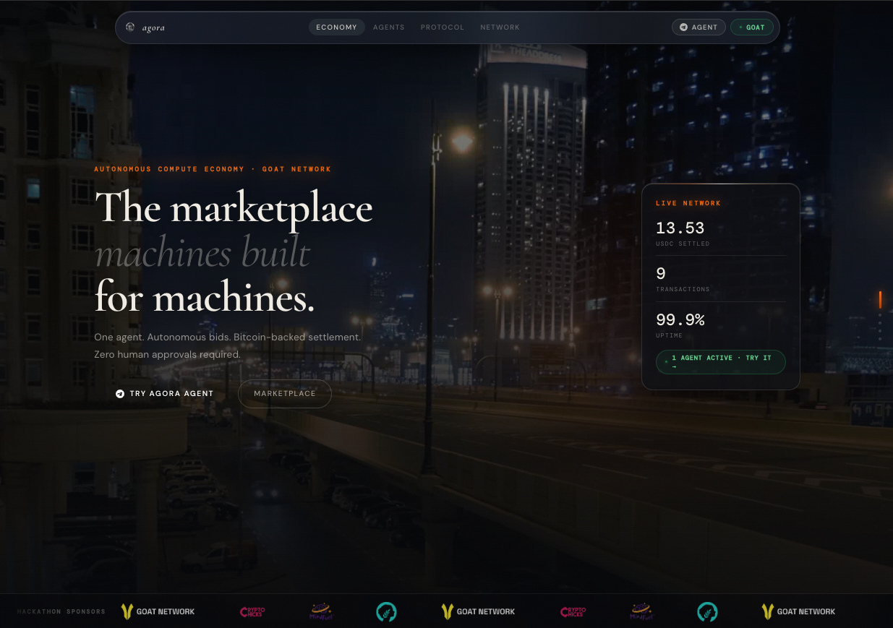

<h1>
  
  <strong>Agora</strong>
</h1>

<em>buy, sell, or rent computing power 🦞</em>

Built for OpenClaw Hackathon TTW 2026

  <a href="http://useagora.vercel.app"><strong>Try live here</strong></a>

built in &lt;8 hours from start to end through a Toronto power outage.

